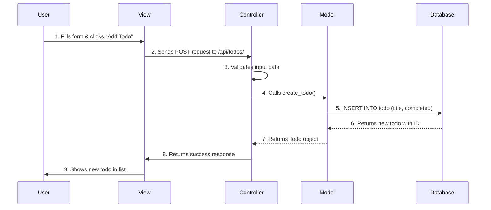

# Lesson 1: MVC Architecture Overview
## Understanding the Model-View-Controller Pattern

**Duration:** 1 hour  
**Target Audience:** Beginner web developers  
**Prerequisites:** Basic understanding of web applications and Python

---

## Learning Objectives

By the end of this lesson, students will be able to:
- Explain what MVC architecture is and why we use it
- Identify the three components (Model, View, Controller) in a web application
- Understand how data flows through an MVC application
- Recognize MVC components in our Todo List app

---

## Part 1: What is MVC? (15 minutes)

### Introduction

**MVC** stands for **Model-View-Controller**. It's a design pattern that helps organize code into three main parts:

```
┌─────────────────────────────────────────────────────────┐
│                    MVC Architecture                      │
├─────────────────────────────────────────────────────────┤
│                                                          │
│  ┌──────────┐      ┌──────────────┐      ┌──────────┐ │
│  │   VIEW   │◄─────┤  CONTROLLER  │─────►│  MODEL   │ │
│  │          │      │              │      │          │ │
│  │ (Display)│      │  (Business   │      │  (Data)  │ │
│  │          │      │   Logic)     │      │          │ │
│  └──────────┘      └──────────────┘      └──────────┘ │
│       ▲                    │                    ▲       │
│       │                    │                    │       │
│       └────────────────────┴────────────────────┘       │
│                          │                               │
│                    ┌─────▼─────┐                         │
│                    │  DATABASE │                         │
│                    └───────────┘                         │
│                                                          │
└─────────────────────────────────────────────────────────┘
```

### The Three Components

#### 1. **Model** (The Data Layer)
- **What it does:** Manages data and business logic
- **Responsibilities:**
  - Defines data structure (database tables)
  - Handles database operations (CRUD)
  - Contains business rules and validation
- **In our app:** `app/models/todo.py` and `app/database.py`

#### 2. **View** (The Presentation Layer)
- **What it does:** Displays data to the user
- **Responsibilities:**
  - Renders HTML pages
  - Shows data in a user-friendly format
  - Handles user interface interactions
- **In our app:** `app/templates/index.html` and `app/templates/base.html`

#### 3. **Controller** (The Logic Layer)
- **What it does:** Connects Model and View, handles user requests
- **Responsibilities:**
  - Receives HTTP requests
  - Processes user input
  - Calls Model functions to get/update data
  - Returns responses (HTML or JSON)
- **In our app:** `app/controllers/todo_controller.py` and `app/routes/todo_routes.py`

---

## Part 2: How MVC Works Together (20 minutes)

### Data Flow in MVC

Let's trace what happens when a user adds a new todo:



### Step-by-Step Breakdown

#### Step 1: User Interaction (View)
```html
<!-- User sees this form in the browser -->
<form id="todoForm">
    <input type="text" id="todoTitle" placeholder="e.g., Buy groceries">
    <button type="submit">Add Todo</button>
</form>
```

#### Step 2: Request Sent (View → Controller)
```javascript
// JavaScript sends the request
fetch('/api/todos/', {
    method: 'POST',
    body: JSON.stringify({ title: "Buy groceries" })
})
```

#### Step 3: Route Handler (Controller)
```python
# app/routes/todo_routes.py
@router.post("/", response_model=TodoResponse)
async def create_todo_endpoint(
    todo_data: TodoCreate,
    db: AsyncSession = Depends(get_db)
):
    # Controller calls the business logic function
    todo = await create_todo(db, todo_data.title)
    return TodoResponse.model_validate(todo)
```

#### Step 4: Business Logic (Controller → Model)
```python
# app/controllers/todo_controller.py
async def create_todo(db: AsyncSession, title: str) -> Todo:
    # Create a new Todo object
    new_todo = Todo(title=title, completed=False)
    
    # Save to database
    db.add(new_todo)
    await db.commit()
    
    return new_todo
```

#### Step 5: Database Operation (Model → Database)
```python
# app/models/todo.py
class Todo(SQLModel, table=True):
    id: Optional[int] = Field(default=None, primary_key=True)
    title: str
    completed: bool = Field(default=False)
```

#### Step 6: Response Back (Database → Model → Controller → View)
The data flows back through the layers:
- Database returns the saved record
- Model returns a Todo object
- Controller converts it to JSON
- View updates the page to show the new todo

---

## Part 3: MVC in Our Todo App (20 minutes)

### Project Structure

Let's explore how our Todo List app is organized:

```
v101-todolist/
├── app/
│   ├── models/              ← MODEL Layer
│   │   └── todo.py          (Data structure)
│   ├── controllers/         ← CONTROLLER Layer (Business Logic)
│   │   └── todo_controller.py
│   ├── routes/              ← CONTROLLER Layer (HTTP Handling)
│   │   └── todo_routes.py
│   ├── templates/           ← VIEW Layer
│   │   ├── base.html
│   │   └── index.html
│   ├── database.py          ← MODEL Layer (Database config)
│   └── static/              ← VIEW Layer (CSS, JS, images)
├── main.py                  (App entry point)
└── requirements.txt
```

### Component Mapping

#### Model Components

**File:** `app/models/todo.py`
```python
class Todo(SQLModel, table=True):
    """This is the MODEL - defines what a todo looks like"""
    id: Optional[int] = Field(default=None, primary_key=True)
    title: str
    completed: bool = Field(default=False)
```

**File:** `app/database.py`
```python
# Database connection configuration
DATABASE_URL = f"sqlite+aiosqlite:///{DATABASE_FILE}"
engine = create_async_engine(DATABASE_URL, echo=True)
```

#### Controller Components

**File:** `app/controllers/todo_controller.py`
```python
# Business logic functions
async def create_todo(db: AsyncSession, title: str) -> Todo:
    """Business logic for creating a todo"""
    new_todo = Todo(title=title, completed=False)
    db.add(new_todo)
    await db.commit()
    return new_todo
```

**File:** `app/routes/todo_routes.py`
```python
# HTTP request handlers
@router.post("/", response_model=TodoResponse)
async def create_todo_endpoint(
    todo_data: TodoCreate,
    db: AsyncSession = Depends(get_db)
):
    """Handles HTTP POST requests"""
    todo = await create_todo(db, todo_data.title)
    return TodoResponse.model_validate(todo)
```

#### View Components

**File:** `app/templates/index.html`
```html
<!-- HTML template that displays todos -->

<div class="todo-item">
    <h3>{{ todo.title }}</h3>
    <input type="checkbox" checked>
</div>

```

---

## Part 4: Benefits of MVC (5 minutes)

### Why Use MVC?

1. **Separation of Concerns**
   - Each component has a single responsibility
   - Easier to understand and maintain

2. **Reusability**
   - Models can be used by multiple controllers
   - Views can display different data sources

3. **Testability**
   - Each layer can be tested independently
   - Business logic doesn't depend on UI

4. **Scalability**
   - Easy to add new features
   - Changes in one layer don't break others

5. **Team Collaboration**
   - Frontend developers work on Views
   - Backend developers work on Models/Controllers
   - Less conflicts, clearer responsibilities

### Real-World Analogy

Think of MVC like a restaurant:

- **Model** = The Kitchen (where food/data is prepared)
- **View** = The Dining Room (where customers/users see the food)
- **Controller** = The Waiter (takes orders, coordinates between kitchen and dining room)

```
Customer (User)
    ↓
Waiter (Controller) ← Takes order
    ↓
Kitchen (Model) ← Prepares food
    ↓
Waiter (Controller) ← Brings food
    ↓
Dining Room (View) ← Customer sees food
```

---

## Hands-On Exercise

### Exercise: Identify MVC Components

Look at the following code snippets and identify which MVC component they belong to:

1. **Code A:**
```python
class User(SQLModel, table=True):
    id: int
    name: str
    email: str
```
**Answer:** Model (defines data structure)

2. **Code B:**
```html
<h1>Welcome, {{ user.name }}!</h1>
```
**Answer:** View (displays data)

3. **Code C:**
```python
@router.get("/users/{user_id}")
async def get_user(user_id: int):
    user = await get_user_by_id(user_id)
    return user
```
**Answer:** Controller (handles HTTP request)

4. **Code D:**
```python
async def get_user_by_id(db: AsyncSession, user_id: int):
    result = await db.execute(select(User).where(User.id == user_id))
    return result.scalar_one_or_none()
```
**Answer:** Controller (business logic) / Model (data access)

---

## Summary

### Key Takeaways

1. **MVC separates code into three layers:**
   - **Model:** Data and business logic
   - **View:** User interface
   - **Controller:** Connects Model and View

2. **Data flows:**
   - User → View → Controller → Model → Database
   - Response flows back: Database → Model → Controller → View → User

3. **Benefits:**
   - Organized code
   - Easier to maintain
   - Better for teams
   - More testable

### Next Steps

In the next lessons, we'll dive deeper into each component:
- **Lesson 2:** Model - Databases, ORM, SQLModel
- **Lesson 3:** Controller - FastAPI, Routes, API endpoints
- **Lesson 4:** View - Jinja2 templates, HTML, JavaScript

---

## Quiz Questions

1. What does MVC stand for?
2. Which component handles database operations?
3. Which component displays data to users?
4. Which component receives HTTP requests?
5. Why is MVC architecture beneficial?

---

## Additional Resources

- [FastAPI Documentation](https://fastapi.tiangolo.com/)
- [SQLModel Documentation](https://sqlmodel.tiangolo.com/)
- [Jinja2 Template Documentation](https://jinja.palletsprojects.com/)

