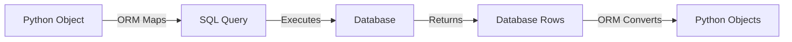

# Lesson 2: Model Layer - Databases, ORM, and Data Management
## Understanding the Data Layer in MVC

**Duration:** 1 hour  
**Target Audience:** Beginner web developers  
**Prerequisites:** Basic Python knowledge, understanding of MVC architecture (Lesson 1)

---

## Learning Objectives

By the end of this lesson, students will be able to:
- Understand what databases are and why we need them
- Explain what an ORM (Object-Relational Mapping) is
- Read and write SQLModel model definitions
- Understand database connections and sessions
- Perform CRUD operations using SQLModel

---

## Part 1: Introduction to Databases (15 minutes)

### What is a Database?

A **database** is an organized collection of data stored electronically. Think of it as a digital filing cabinet.

```
┌─────────────────────────────────────┐
│         DATABASE                     │
│  ┌───────────────────────────────┐   │
│  │         TABLE: todo          │   │
│  ├──────┬──────────────┬────────┤   │
│  │  id  │    title     │completed│   │
│  ├──────┼──────────────┼────────┤   │
│  │  1   │ Buy groceries│  false │   │
│  │  2   │ Finish homework│ true │   │
│  │  3   │ Call mom     │  false │   │
│  └──────┴──────────────┴────────┘   │
└─────────────────────────────────────┘
```

### Why Do We Need Databases?

1. **Data Persistence**
   - Data survives after the application closes
   - Data persists across server restarts

2. **Data Organization**
   - Structured storage (tables, rows, columns)
   - Easy to query and search

3. **Data Integrity**
   - Validation rules
   - Relationships between data

4. **Concurrent Access**
   - Multiple users can access data simultaneously
   - Database handles locking and transactions

### SQLite vs Other Databases

**SQLite** (what we use):
- ✅ File-based (single `.db` file)
- ✅ No server needed
- ✅ Perfect for learning and small apps
- ✅ Lightweight and fast
- ❌ Not ideal for high-traffic applications

**Other Databases** (PostgreSQL, MySQL):
- ✅ Server-based
- ✅ Better for production apps
- ✅ Handles high traffic
- ❌ More complex setup

---

## Part 2: Understanding ORM (Object-Relational Mapping) (15 minutes)

### What is an ORM?

**ORM** stands for **Object-Relational Mapping**. It's a technique that lets us interact with databases using Python objects instead of writing raw SQL.

### Without ORM (Raw SQL):
```python
# Hard to read, error-prone, not Pythonic
cursor.execute("INSERT INTO todo (title, completed) VALUES (?, ?)", 
               ("Buy groceries", False))
```

### With ORM (SQLModel):
```python
# Clean, Pythonic, type-safe
todo = Todo(title="Buy groceries", completed=False)
db.add(todo)
await db.commit()
```

### How ORM Works



**Example:**
```python
# Python Object
todo = Todo(title="Buy groceries", completed=False)

# ORM converts to SQL:
# INSERT INTO todo (title, completed) VALUES ('Buy groceries', 0)

# Database returns row:
# (1, 'Buy groceries', 0)

# ORM converts back to Python Object:
# Todo(id=1, title="Buy groceries", completed=False)
```

---

## Part 3: SQLModel Models (20 minutes)

### Our Todo Model

Let's examine our Todo model in detail:

**File:** `app/models/todo.py`

```python
from typing import Optional
from sqlmodel import SQLModel, Field

class Todo(SQLModel, table=True):
    """
    Todo Model - Represents a todo item in the database.
    
    This class defines:
    1. The database table structure (columns, types, constraints)
    2. How Python objects map to database rows
    """
    
    # Primary key - unique identifier for each todo
    id: Optional[int] = Field(default=None, primary_key=True)
    
    # Todo title - the text describing what needs to be done
    title: str = Field(max_length=200)
    
    # Completion status - whether the todo is done or not
    completed: bool = Field(default=False)
```

### Breaking Down the Model

#### 1. Class Definition
```python
class Todo(SQLModel, table=True):
```
- `SQLModel`: Base class that provides ORM functionality
- `table=True`: Makes this a database table (not just a data class)

#### 2. Primary Key
```python
id: Optional[int] = Field(default=None, primary_key=True)
```
- **Primary Key:** Unique identifier for each row
- **Optional[int]:** Can be `None` initially (database auto-generates it)
- **Field():** SQLModel field definition with properties

#### 3. String Field
```python
title: str = Field(max_length=200)
```
- **str:** Python type (maps to VARCHAR/TEXT in database)
- **max_length=200:** Database constraint (max 200 characters)

#### 4. Boolean Field
```python
completed: bool = Field(default=False)
```
- **bool:** Python type (maps to BOOLEAN/INTEGER in database)
- **default=False:** Default value when creating new todos

### Model to Database Mapping

```
Python Model          →    Database Table
─────────────────────────────────────────────
class Todo            →    CREATE TABLE todo (
  id: int             →      id INTEGER PRIMARY KEY,
  title: str          →      title VARCHAR(200),
  completed: bool     →      completed BOOLEAN
                            );
```

### Visual Representation

```
┌─────────────────────────────────────────┐
│         Python Todo Object              │
├─────────────────────────────────────────┤
│  id: 1                                  │
│  title: "Buy groceries"                 │
│  completed: False                       │
└─────────────────────────────────────────┘
              ↕ ORM Mapping
┌─────────────────────────────────────────┐
│         Database Table Row              │
├──────┬──────────────┬───────────────┤
│  id  │    title     │   completed   │
├──────┼──────────────┼───────────────┤
│  1   │Buy groceries │      0        │
└──────┴──────────────┴───────────────┘
```

---

## Part 4: Database Configuration (10 minutes)

### Database Setup

**File:** `app/database.py`

```python
import os
from sqlalchemy.ext.asyncio import AsyncSession, create_async_engine, async_sessionmaker
from sqlmodel import SQLModel

# Database URL - tells SQLAlchemy where to find/create the database
DATABASE_DIR = os.getenv("DATABASE_DIR", "./")
DATABASE_FILE = os.path.join(DATABASE_DIR, "database.db")
DATABASE_URL = f"sqlite+aiosqlite:///{DATABASE_FILE}"

# Create the database engine
# This is like opening a connection to the database
engine = create_async_engine(DATABASE_URL, echo=True)

# Create a session factory
# A session is like a conversation with the database
AsyncSessionLocal = async_sessionmaker(
    engine,
    class_=AsyncSession,
    expire_on_commit=False
)
```

### Key Concepts

#### 1. Database Engine
```python
engine = create_async_engine(DATABASE_URL, echo=True)
```
- **Engine:** Manages database connections
- **echo=True:** Prints all SQL queries (great for learning!)

#### 2. Session Factory
```python
AsyncSessionLocal = async_sessionmaker(...)
```
- **Session:** A conversation with the database
- **Factory:** Creates new sessions when needed
- **Async:** Non-blocking (doesn't freeze the app)

#### 3. Database Session Dependency
```python
async def get_db() -> AsyncSession:
    async with AsyncSessionLocal() as session:
        yield session
```
- **Dependency:** FastAPI automatically provides this
- **yield:** Keeps session open during request, closes after

### Database Initialization

**File:** `app/database.py`

```python
async def init_db() -> None:
    """
    Initialize the database by creating all tables.
    
    This reads all SQLModel classes and creates the corresponding tables.
    """
    async with engine.begin() as conn:
        await conn.run_sync(SQLModel.metadata.create_all)
```

**What happens:**
1. App starts
2. `init_db()` is called
3. SQLModel looks at all `table=True` classes
4. Creates tables that don't exist
5. Database is ready!

---

## Part 5: CRUD Operations (20 minutes)

**CRUD** stands for:
- **C**reate
- **R**ead
- **U**pdate
- **D**elete

These are the four basic database operations.

### Create Operation

**File:** `app/controllers/todo_controller.py`

```python
async def create_todo(db: AsyncSession, title: str) -> Todo:
    """
    Create a new todo item.
    
    Steps:
    1. Create a Todo object
    2. Add it to the session
    3. Commit to save
    4. Refresh to get the ID
    """
    # Step 1: Create Python object
    new_todo = Todo(title=title, completed=False)
    
    # Step 2: Stage the change (not saved yet)
    db.add(new_todo)
    
    # Step 3: Actually save to database
    await db.commit()
    
    # Step 4: Refresh to get auto-generated ID
    await db.refresh(new_todo)
    
    return new_todo
```

**Visual Flow:**
```
Python Code              →    Database
─────────────────────────────────────────
Todo(title="Buy milk")   →    (not in DB yet)
db.add(todo)             →    (staged)
await db.commit()        →    INSERT INTO todo...
await db.refresh(todo)   →    SELECT * FROM todo WHERE id=1
return todo              →    Todo(id=1, title="Buy milk", ...)
```

### Read Operations

#### Read All Todos
```python
async def get_all_todos(db: AsyncSession) -> List[Todo]:
    """
    Retrieve all todos from the database.
    """
    # Create a SELECT query
    statement = select(Todo)
    
    # Execute the query
    result = await db.execute(statement)
    
    # Convert results to Python objects
    todos = result.scalars().all()
    
    return todos
```

**SQL Equivalent:**
```sql
SELECT * FROM todo;
```

#### Read One Todo by ID
```python
async def get_todo_by_id(db: AsyncSession, todo_id: int) -> Optional[Todo]:
    """
    Retrieve a specific todo by its ID.
    """
    # SELECT with WHERE clause
    statement = select(Todo).where(Todo.id == todo_id)
    
    # Execute query
    result = await db.execute(statement)
    
    # Get first result or None
    todo = result.scalar_one_or_none()
    
    return todo
```

**SQL Equivalent:**
```sql
SELECT * FROM todo WHERE id = 1;
```

### Update Operation

```python
async def update_todo(
    db: AsyncSession,
    todo_id: int,
    title: Optional[str] = None,
    completed: Optional[bool] = None
) -> Todo:
    """
    Update an existing todo item.
    
    Steps:
    1. Get the existing todo
    2. Modify its properties
    3. Add to session (SQLAlchemy tracks changes)
    4. Commit to save
    """
    # Step 1: Get existing todo
    todo = await get_todo_by_id(db, todo_id)
    
    if not todo:
        raise HTTPException(status_code=404, detail="Todo not found")
    
    # Step 2: Update fields (only if provided)
    if title is not None:
        todo.title = title
    if completed is not None:
        todo.completed = completed
    
    # Step 3: Stage the change
    db.add(todo)
    
    # Step 4: Save to database
    await db.commit()
    await db.refresh(todo)
    
    return todo
```

**SQL Equivalent:**
```sql
UPDATE todo 
SET title = 'New title', completed = 1 
WHERE id = 1;
```

### Delete Operation

```python
async def delete_todo(db: AsyncSession, todo_id: int) -> bool:
    """
    Delete a todo item from the database.
    
    Steps:
    1. Get the todo
    2. Delete it
    3. Commit to save
    """
    # Step 1: Get the todo
    todo = await get_todo_by_id(db, todo_id)
    
    if not todo:
        raise HTTPException(status_code=404, detail="Todo not found")
    
    # Step 2: Delete from database
    await db.delete(todo)
    
    # Step 3: Save the deletion
    await db.commit()
    
    return True
```

**SQL Equivalent:**
```sql
DELETE FROM todo WHERE id = 1;
```

---

## Part 6: Database Relationships (Optional - Advanced)

### One-to-Many Relationship Example

If we wanted to add categories to todos:

```python
class Category(SQLModel, table=True):
    id: Optional[int] = Field(default=None, primary_key=True)
    name: str

class Todo(SQLModel, table=True):
    id: Optional[int] = Field(default=None, primary_key=True)
    title: str
    completed: bool = Field(default=False)
    category_id: Optional[int] = Field(default=None, foreign_key="category.id")
    
    # Relationship
    category: Optional[Category] = Relationship()
```

**Visual:**
```
Category Table          Todo Table
┌────┬──────────┐      ┌────┬──────────┬─────────────┐
│ id │   name  │      │ id │   title  │ category_id │
├────┼──────────┤      ├────┼──────────┼─────────────┤
│ 1  │ Personal│◄─────┤ 1  │ Buy milk │      1       │
│ 2  │ Work    │      │ 2  │ Meeting  │      2       │
└────┴──────────┘      └────┴──────────┴─────────────┘
```

---

## Hands-On Exercise

### Exercise: Create a New Model

Create a `Note` model with the following fields:
- `id`: Primary key (auto-generated)
- `content`: Text field (max 500 characters)
- `created_at`: Timestamp (optional for now)

**Solution:**
```python
from typing import Optional
from sqlmodel import SQLModel, Field

class Note(SQLModel, table=True):
    id: Optional[int] = Field(default=None, primary_key=True)
    content: str = Field(max_length=500)
```

---

## Summary

### Key Takeaways

1. **Databases** store data persistently
2. **ORM** lets us use Python objects instead of SQL
3. **SQLModel** combines SQLAlchemy + Pydantic
4. **Models** define table structure using Python classes
5. **Sessions** manage database conversations
6. **CRUD** operations: Create, Read, Update, Delete

### Database Concepts Recap

```
Model Definition    →    Database Table
─────────────────────────────────────────
class Todo          →    CREATE TABLE todo
  id: int           →      id INTEGER PRIMARY KEY
  title: str        →      title VARCHAR(200)
  completed: bool   →      completed BOOLEAN
```

### Next Steps

In the next lesson, we'll learn about:
- **Controller Layer:** FastAPI routes
- **HTTP endpoints:** GET, POST, PUT, DELETE
- **API documentation:** Swagger/OpenAPI

---

## Quiz Questions

1. What does ORM stand for?
2. What does `table=True` do in SQLModel?
3. What is a primary key?
4. What are the four CRUD operations?
5. What does `db.commit()` do?

---

## Additional Resources

- [SQLModel Documentation](https://sqlmodel.tiangolo.com/)
- [SQLAlchemy Documentation](https://docs.sqlalchemy.org/)
- [SQLite Tutorial](https://www.sqlitetutorial.net/)

