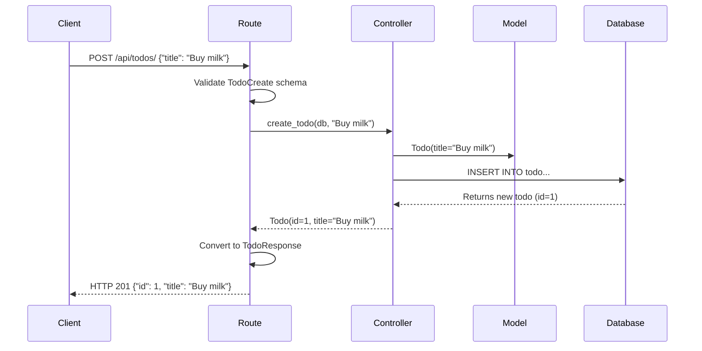

# Lesson 3: Controller Layer - FastAPI, Routes, and API Endpoints
## Understanding the Logic Layer in MVC

**Duration:** 1 hour  
**Target Audience:** Beginner web developers  
**Prerequisites:** Understanding of MVC architecture (Lesson 1) and Models (Lesson 2)

---

## Learning Objectives

By the end of this lesson, students will be able to:
- Understand what FastAPI is and how it works
- Explain the difference between routes and controllers
- Create API endpoints (GET, POST, PUT, DELETE)
- Understand HTTP methods and status codes
- Use Swagger/OpenAPI documentation
- Handle request validation with Pydantic

---

## Part 1: Introduction to FastAPI (10 minutes)

### What is FastAPI?

**FastAPI** is a modern Python web framework for building APIs. It's fast, easy to use, and automatically generates API documentation.

### Why FastAPI?

1. **Automatic Documentation**
   - Swagger UI at `/docs`
   - OpenAPI schema generation

2. **Type Safety**
   - Uses Python type hints
   - Automatic validation

3. **Async Support**
   - Built for async/await
   - High performance

4. **Modern Python**
   - Based on Python 3.6+ type hints
   - Uses Pydantic for validation

### FastAPI Application Structure

```
┌─────────────────────────────────────────┐
│         FastAPI Application             │
├─────────────────────────────────────────┤
│                                         │
│  ┌──────────────┐                       │
│  │   Routes     │  ← Define endpoints   │
│  └──────┬───────┘                       │
│         │                               │
│  ┌──────▼───────┐                       │
│  │ Controllers  │  ← Business logic    │
│  └──────┬───────┘                       │
│         │                               │
│  ┌──────▼───────┐                       │
│  │   Models     │  ← Data layer         │
│  └──────┬───────┘                       │
│         │                               │
│  ┌──────▼───────┐                       │
│  │  Database    │  ← Data storage       │
│  └──────────────┘                       │
│                                         │
└─────────────────────────────────────────┘
```

---

## Part 2: Routes vs Controllers (15 minutes)

### Understanding the Separation

In our MVC architecture, we have **two parts** of the Controller layer:

#### 1. Routes (`app/routes/todo_routes.py`)
- **Purpose:** Handle HTTP requests/responses
- **Responsibilities:**
  - Define URL endpoints
  - Validate input data
  - Call controller functions
  - Return HTTP responses

#### 2. Controllers (`app/controllers/todo_controller.py`)
- **Purpose:** Business logic
- **Responsibilities:**
  - Perform operations on data
  - Handle business rules
  - Interact with models
  - Return data objects

### Visual Separation

```
HTTP Request
    ↓
┌─────────────────────────────────────┐
│         ROUTES                      │
│  - Receive HTTP request             │
│  - Validate input                   │
│  - Call controller function         │
│  - Return HTTP response             │
└──────────────┬──────────────────────┘
               │
               ↓
┌─────────────────────────────────────┐
│       CONTROLLERS                   │
│  - Business logic                   │
│  - Data operations                  │
│  - Return data objects              │
└──────────────┬──────────────────────┘
               │
               ↓
┌─────────────────────────────────────┐
│         MODELS                      │
│  - Database operations              │
└─────────────────────────────────────┘
```

### Example Flow

**Route (HTTP Handler):**
```python
# app/routes/todo_routes.py
@router.post("/", response_model=TodoResponse)
async def create_todo_endpoint(
    todo_data: TodoCreate,  # Validates input
    db: AsyncSession = Depends(get_db)
):
    # Call controller function
    todo = await create_todo(db, todo_data.title)
    
    # Return HTTP response
    return TodoResponse.model_validate(todo)
```

**Controller (Business Logic):**
```python
# app/controllers/todo_controller.py
async def create_todo(db: AsyncSession, title: str) -> Todo:
    # Business logic here
    new_todo = Todo(title=title, completed=False)
    db.add(new_todo)
    await db.commit()
    return new_todo
```

---

## Part 3: HTTP Methods and REST API (15 minutes)

### HTTP Methods

HTTP methods indicate what action you want to perform:

| Method | Purpose | Example |
|--------|---------|---------|
| **GET** | Retrieve data | Get all todos |
| **POST** | Create new data | Create a new todo |
| **PUT** | Update existing data | Update a todo |
| **DELETE** | Remove data | Delete a todo |

### REST API Design

**REST** stands for **Representational State Transfer**. It's a way of designing APIs.

**Our Todo API:**
```
GET    /api/todos/list      → Get all todos
GET    /api/todos/{id}      → Get one todo
POST   /api/todos/          → Create a todo
PUT    /api/todos/{id}      → Update a todo
DELETE /api/todos/{id}      → Delete a todo
```

### HTTP Status Codes

Status codes tell the client if the request was successful:

| Code | Meaning | When to Use |
|------|---------|-------------|
| **200** | OK | Successful GET/PUT request |
| **201** | Created | Successful POST request |
| **204** | No Content | Successful DELETE request |
| **400** | Bad Request | Invalid input data |
| **404** | Not Found | Resource doesn't exist |
| **500** | Server Error | Something went wrong |

---

## Part 4: Creating API Endpoints (20 minutes)

### Setting Up Routes

**File:** `app/routes/todo_routes.py`

```python
from fastapi import APIRouter, Depends
from sqlalchemy.ext.asyncio import AsyncSession
from app.database import get_db

# Create a router
router = APIRouter(
    prefix="/api/todos",  # All routes start with /api/todos
    tags=["todos"]        # Groups endpoints in Swagger docs
)
```

### 1. GET - Retrieve All Todos

```python
@router.get("/list", response_model=List[TodoResponse])
async def get_all_todos_endpoint(
    db: AsyncSession = Depends(get_db)
) -> List[TodoResponse]:
    """
    Get all todos.
    
    - **URL:** GET /api/todos/list
    - **Response:** List of all todos
    """
    todos = await get_all_todos(db)
    return [TodoResponse.model_validate(todo) for todo in todos]
```

**How it works:**
1. Client sends: `GET /api/todos/list`
2. FastAPI calls: `get_all_todos_endpoint()`
3. Function calls: `get_all_todos(db)` (controller)
4. Returns: List of todos as JSON

### 2. GET - Retrieve One Todo

```python
@router.get("/{todo_id}", response_model=TodoResponse)
async def get_todo_endpoint(
    todo_id: int,  # Path parameter
    db: AsyncSession = Depends(get_db)
) -> TodoResponse:
    """
    Get a specific todo by ID.
    
    - **URL:** GET /api/todos/{todo_id}
    - **Path Parameter:** todo_id (integer)
    """
    todo = await get_todo_by_id(db, todo_id)
    
    if not todo:
        raise HTTPException(status_code=404, detail="Todo not found")
    
    return TodoResponse.model_validate(todo)
```

**Path Parameters:**
- `{todo_id}` in the URL becomes `todo_id` parameter
- Example: `/api/todos/1` → `todo_id = 1`

### 3. POST - Create a Todo

```python
@router.post("/", response_model=TodoResponse, status_code=201)
async def create_todo_endpoint(
    todo_data: TodoCreate,  # Request body (validated)
    db: AsyncSession = Depends(get_db)
) -> TodoResponse:
    """
    Create a new todo.
    
    - **URL:** POST /api/todos/
    - **Request Body:** JSON with "title" field
    - **Response:** Created todo (status 201)
    """
    todo = await create_todo(db, todo_data.title)
    return TodoResponse.model_validate(todo)
```

**Request Body:**
```json
{
    "title": "Buy groceries"
}
```

**Pydantic Schema:**
```python
class TodoCreate(BaseModel):
    title: str  # Required field
```

### 4. PUT - Update a Todo

```python
@router.put("/{todo_id}", response_model=TodoResponse)
async def update_todo_endpoint(
    todo_id: int,
    todo_data: TodoUpdate,  # Request body
    db: AsyncSession = Depends(get_db)
) -> TodoResponse:
    """
    Update an existing todo.
    
    - **URL:** PUT /api/todos/{todo_id}
    - **Request Body:** JSON with "title" and/or "completed"
    """
    todo = await update_todo(
        db,
        todo_id,
        title=todo_data.title,
        completed=todo_data.completed
    )
    return TodoResponse.model_validate(todo)
```

**Request Body:**
```json
{
    "title": "Buy organic groceries",
    "completed": true
}
```

### 5. DELETE - Remove a Todo

```python
@router.delete("/{todo_id}", status_code=204)
async def delete_todo_endpoint(
    todo_id: int,
    db: AsyncSession = Depends(get_db)
):
    """
    Delete a todo.
    
    - **URL:** DELETE /api/todos/{todo_id}
    - **Response:** No content (status 204)
    """
    await delete_todo(db, todo_id)
    return None  # 204 No Content
```

---

## Part 5: Pydantic Schemas (10 minutes)

### What are Pydantic Schemas?

**Pydantic** schemas validate and serialize data. They define:
- What data is expected
- What types are allowed
- What fields are required/optional

### Our Schemas

**File:** `app/routes/todo_routes.py`

```python
from pydantic import BaseModel

# Schema for creating a todo
class TodoCreate(BaseModel):
    title: str  # Required string field

# Schema for updating a todo
class TodoUpdate(BaseModel):
    title: str | None = None        # Optional
    completed: bool | None = None   # Optional

# Schema for responses
class TodoResponse(BaseModel):
    id: int
    title: str
    completed: bool
    
    # Allow conversion from SQLModel objects
    model_config = {
        "from_attributes": True
    }
```

### How Validation Works

```
Client sends JSON
    ↓
FastAPI validates against TodoCreate schema
    ↓
If valid → Continue
If invalid → Return 422 error
```

**Example - Valid Request:**
```json
{
    "title": "Buy groceries"
}
```
✅ Passes validation

**Example - Invalid Request:**
```json
{
    "title": 123  // Not a string!
}
```
❌ Returns 422 error

---

## Part 6: Dependency Injection (10 minutes)

### What is Dependency Injection?

**Dependency Injection** is a way to provide dependencies (like database sessions) to functions automatically.

### Database Dependency

**File:** `app/database.py`

```python
async def get_db() -> AsyncSession:
    """
    Dependency function for FastAPI.
    
    FastAPI automatically:
    1. Calls this function when needed
    2. Provides the session to routes
    3. Closes the session after the request
    """
    async with AsyncSessionLocal() as session:
        yield session
```

### Using Dependencies

```python
@router.get("/list")
async def get_all_todos_endpoint(
    db: AsyncSession = Depends(get_db)  # ← Dependency injection
):
    # db is automatically provided by FastAPI
    todos = await get_all_todos(db)
    return todos
```

**Benefits:**
- ✅ No need to manually create sessions
- ✅ Automatic cleanup
- ✅ Easy to test (can mock dependencies)
- ✅ Consistent session management

---

## Part 7: Swagger/OpenAPI Documentation (10 minutes)

### Automatic Documentation

FastAPI automatically generates interactive API documentation!

**Access:**
- Swagger UI: `http://localhost:8000/docs`
- ReDoc: `http://localhost:8000/redoc`

### What You See in Swagger

```
┌─────────────────────────────────────────┐
│  Todo List API - Swagger UI            │
├─────────────────────────────────────────┤
│                                         │
│  POST /api/todos/                      │
│  Create a new todo                     │
│  [Try it out]                          │
│                                         │
│  GET /api/todos/list                   │
│  Get all todos                         │
│  [Try it out]                          │
│                                         │
│  GET /api/todos/{todo_id}              │
│  Get a specific todo                    │
│  [Try it out]                          │
│                                         │
└─────────────────────────────────────────┘
```

### Using Swagger to Test

1. **Open:** `http://localhost:8000/docs`
2. **Click** on an endpoint (e.g., "POST /api/todos/")
3. **Click** "Try it out"
4. **Enter** request data:
   ```json
   {
       "title": "Test todo"
   }
   ```
5. **Click** "Execute"
6. **See** the response!

---

## Part 8: Complete Request Flow (10 minutes)

### Full Request Cycle

Let's trace a complete request:



### Step-by-Step Breakdown

**1. Client sends request:**
```bash
POST /api/todos/
Content-Type: application/json

{
    "title": "Buy milk"
}
```

**2. Route receives request:**
```python
@router.post("/", response_model=TodoResponse)
async def create_todo_endpoint(
    todo_data: TodoCreate,  # ← FastAPI validates JSON
    db: AsyncSession = Depends(get_db)  # ← FastAPI provides session
):
```

**3. Route calls controller:**
```python
todo = await create_todo(db, todo_data.title)
```

**4. Controller performs business logic:**
```python
async def create_todo(db: AsyncSession, title: str) -> Todo:
    new_todo = Todo(title=title, completed=False)
    db.add(new_todo)
    await db.commit()
    return new_todo
```

**5. Response flows back:**
```python
return TodoResponse.model_validate(todo)
# Returns: {"id": 1, "title": "Buy milk", "completed": false}
```

---

## Hands-On Exercise

### Exercise: Create a New Endpoint

Create an endpoint to get todos by completion status:

**Requirements:**
- URL: `GET /api/todos/status/{completed}`
- Path parameter: `completed` (boolean)
- Returns: List of todos matching the status

**Solution:**
```python
@router.get("/status/{completed}", response_model=List[TodoResponse])
async def get_todos_by_status(
    completed: bool,
    db: AsyncSession = Depends(get_db)
) -> List[TodoResponse]:
    """
    Get todos by completion status.
    
    - **URL:** GET /api/todos/status/{completed}
    - **Path Parameter:** completed (true/false)
    """
    todos = await get_all_todos(db)
    filtered = [t for t in todos if t.completed == completed]
    return [TodoResponse.model_validate(todo) for todo in filtered]
```

---

## Summary

### Key Takeaways

1. **FastAPI** is a modern Python web framework
2. **Routes** handle HTTP requests/responses
3. **Controllers** contain business logic
4. **HTTP Methods:** GET, POST, PUT, DELETE
5. **Pydantic** validates request/response data
6. **Dependency Injection** provides database sessions
7. **Swagger** provides automatic API documentation

### Request Flow Recap

```
HTTP Request
    ↓
Route (validates input)
    ↓
Controller (business logic)
    ↓
Model (database operations)
    ↓
Database
    ↓
Response flows back
```

### Next Steps

In the next lesson, we'll learn about:
- **View Layer:** Jinja2 templates
- **HTML rendering:** Displaying data
- **JavaScript:** Frontend interactivity

---

## Quiz Questions

1. What is FastAPI?
2. What's the difference between routes and controllers?
3. What HTTP method is used to create new data?
4. What does Pydantic do?
5. How do you access API documentation?

---

## Additional Resources

- [FastAPI Documentation](https://fastapi.tiangolo.com/)
- [Pydantic Documentation](https://docs.pydantic.dev/)
- [REST API Tutorial](https://restfulapi.net/)

