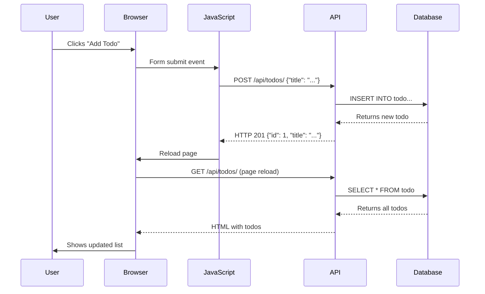

# Lesson 4: View Layer - Jinja2 Templates and Frontend
## Understanding the Presentation Layer in MVC

**Duration:** 1 hour  
**Target Audience:** Beginner web developers  
**Prerequisites:** Understanding of MVC architecture (Lesson 1), Models (Lesson 2), and Controllers (Lesson 3)

---

## Learning Objectives

By the end of this lesson, students will be able to:
- Understand what Jinja2 is and how it works
- Create HTML templates with template inheritance
- Use Jinja2 syntax for displaying data
- Understand how templates connect to controllers
- Add JavaScript for frontend interactivity
- Build a complete user interface

---

## Part 1: Introduction to Templates (10 minutes)

### What is a Template?

A **template** is an HTML file with placeholders for dynamic data. Think of it as a form letter where you fill in the blanks.

### Without Templates (Static HTML):
```html
<h1>Todo List</h1>
<ul>
    <li>Buy groceries</li>
    <li>Finish homework</li>
</ul>
```
❌ Data is hardcoded, can't change dynamically

### With Templates (Dynamic HTML):
```html
<h1>Todo List</h1>
<ul>
    
    <li>{{ todo.title }}</li>
    
</ul>
```
✅ Data comes from the database, updates automatically

### What is Jinja2?

**Jinja2** is a templating engine for Python. It lets us:
- Insert dynamic data into HTML
- Use loops and conditionals
- Reuse template components
- Build complex layouts

---

## Part 2: Template Inheritance (15 minutes)

### Base Template

**File:** `app/templates/base.html`

```html
<!DOCTYPE html>
<html lang="en" class="h-full">
<head>
    <meta charset="UTF-8">
    <meta name="viewport" content="width=device-width, initial-scale=1.0">
    <title>Todo List</title>
    <script src="https://cdn.tailwindcss.com"></script>
</head>
<body class="h-full bg-gray-50">
    <div class="min-h-full">
        
    </div>
    
</body>
</html>
```

### Key Concepts

#### 1. Blocks
```html
Todo List
```
- **Block:** A placeholder that child templates can fill
- **Default content:** "Todo List" (shown if not overridden)

#### 2. Template Inheritance
```html

```
- **extends:** Inherits from base template
- Child template fills in the blocks

### Child Template

**File:** `app/templates/index.html`

```html


Todo List - Home


<div class="max-w-4xl mx-auto px-4 py-8">
    <h1 class="text-3xl font-bold mb-4">My Todo List</h1>
    <!-- Todo list content here -->
</div>



<script>
    // JavaScript code here
</script>

```

### Visual Representation

```
base.html (Parent)
├── <head>
│   └── 
├── <body>
│   ├── 
│   └── 
│
index.html (Child)
├── 
├──  ← Fills parent's title block
├──  ← Fills parent's content block
└──  ← Fills parent's scripts block
```

---

## Part 3: Jinja2 Syntax (20 minutes)

### Displaying Variables

**Syntax:** `{{ variable }}`

```html
<h1>Welcome, {{ user.name }}!</h1>
<p>You have {{ todo_count }} todos.</p>
```

**Output:**
```html
<h1>Welcome, John!</h1>
<p>You have 5 todos.</p>
```

### Loops

**Syntax:** ``

```html
<ul>
    
    <li>{{ todo.title }}</li>
    
</ul>
```

**If todos = [Todo(id=1, title="Buy milk"), Todo(id=2, title="Finish homework")]**

**Output:**
```html
<ul>
    <li>Buy milk</li>
    <li>Finish homework</li>
</ul>
```

### Conditionals

**Syntax:** ``

```html

    <span class="completed">✓ Done</span>

    <span class="pending">○ Pending</span>

```

**Advanced Conditionals:**
```html

    <span>Completed</span>

    <span>High Priority</span>

    <span>Normal</span>

```

### Combining Loops and Conditionals

**Our Todo List Template:**

```html

<div class="todo-item">
    <h3>{{ todo.title }}</h3>
    
    
        <span class="status completed">✓ Completed</span>
    
        <span class="status pending">○ Pending</span>
    
</div>

```

---

## Part 4: Rendering Templates in FastAPI (10 minutes)

### Connecting Controller to View

**File:** `app/routes/todo_routes.py`

```python
from fastapi.templating import Jinja2Templates
from fastapi.responses import HTMLResponse

# Initialize templates
templates = Jinja2Templates(directory="app/templates")

@router.get("/", response_class=HTMLResponse)
async def todos_page(
    request: Request,
    db: AsyncSession = Depends(get_db)
):
    """
    Render the main todos page (HTML view).
    
    Steps:
    1. Get todos from database
    2. Pass them to template
    3. Return rendered HTML
    """
    # Step 1: Get data
    todos = await get_all_todos(db)
    
    # Step 2 & 3: Render template with data
    return templates.TemplateResponse(
        "index.html",  # Template file name
        {
            "request": request,  # Required by Jinja2
            "todos": todos       # Data to display
        }
    )
```

### How It Works

```
User visits /api/todos/
    ↓
Route handler receives request
    ↓
Controller gets todos from database
    ↓
Template engine renders HTML with todos data
    ↓
HTML sent to browser
    ↓
User sees rendered page
```

### Visual Flow

```
┌─────────────────────────────────────────┐
│         Database                        │
│  todos = [Todo(...), Todo(...)]         │
└──────────────┬──────────────────────────┘
               │
               ↓
┌─────────────────────────────────────────┐
│         Controller                      │
│  todos = await get_all_todos(db)        │
└──────────────┬──────────────────────────┘
               │
               ↓
┌─────────────────────────────────────────┐
│         Template Engine                 │
│  templates.TemplateResponse(            │
│      "index.html",                      │
│      {"todos": todos}                   │
│  )                                      │
└──────────────┬──────────────────────────┘
               │
               ↓
┌─────────────────────────────────────────┐
│         Rendered HTML                   │
│  <div>                                  │
│    <h3>Buy groceries</h3>               │
│    <span>Pending</span>                 │
│  </div>                                 │
└──────────────┬──────────────────────────┘
               │
               ↓
┌─────────────────────────────────────────┐
│         Browser                         │
│  User sees the page                     │
└─────────────────────────────────────────┘
```

---

## Part 5: Our Todo List Template (15 minutes)

### Complete Template Structure

**File:** `app/templates/index.html`

```html


Todo List - Home


<div class="max-w-4xl mx-auto px-4 py-8">
    <!-- Page Header -->
    <h1 class="text-3xl font-bold mb-4">My Todo List</h1>
    
    <!-- Add Todo Form -->
    <form id="todoForm" class="mb-8">
        <input 
            type="text" 
            id="todoTitle" 
            placeholder="What do you need to do?"
            class="border-2 border-black rounded-lg px-4 py-2"
        >
        <button type="submit" class="bg-black text-white px-6 py-2 rounded-lg">
            Add Todo
        </button>
    </form>
    
    <!-- Todos List -->
    <div class="space-y-4">
        
        <div class="todo-item bg-white border-2 border-black rounded-lg p-4">
            <!-- Checkbox -->
            <input 
                type="checkbox" 
                checked
                onchange="toggleTodo({{ todo.id }}, this.checked)"
            >
            
            <!-- Todo Title -->
            <h3 class="line-through text-gray-500">
                {{ todo.title }}
            </h3>
            
            <!-- Status -->
            
                <span class="text-green-600">✓ Completed</span>
            
                <span class="text-yellow-600">○ Pending</span>
            
            
            <!-- Action Buttons -->
            <button onclick="deleteTodo({{ todo.id }})">Delete</button>
        </div>
        
    </div>
</div>

```

### Template Breakdown

#### 1. Form for Adding Todos
```html
<form id="todoForm">
    <input type="text" id="todoTitle" placeholder="...">
    <button type="submit">Add Todo</button>
</form>
```
- User enters todo title
- JavaScript handles submission (see Part 6)

#### 2. Loop Through Todos
```html

    <!-- Display each todo -->

```
- Iterates over todos from database
- Displays each one

#### 3. Conditional Styling
```html

    <span class="completed">✓ Completed</span>

    <span class="pending">○ Pending</span>

```
- Shows different content based on completion status

#### 4. Dynamic Attributes
```html
<input 
    type="checkbox" 
    checked
    onchange="toggleTodo({{ todo.id }}, this.checked)"
>
```
- Checkbox is checked if todo is completed
- `{{ todo.id }}` inserts the actual ID

---

## Part 6: JavaScript for Interactivity (20 minutes)

### Why JavaScript?

**JavaScript** adds interactivity to our static HTML:
- Submit forms without page reload
- Update todos dynamically
- Delete todos with confirmation
- Better user experience

### API Client Setup

**File:** `app/templates/index.html` (in ``)

```javascript
// API Base URL
const API_BASE_URL = '/api/todos';
```

### 1. Add Todo Function

```javascript
document.getElementById('todoForm').addEventListener('submit', async (e) => {
    e.preventDefault(); // Prevent page reload
    
    // Get input value
    const titleInput = document.getElementById('todoTitle');
    const title = titleInput.value.trim();
    
    if (!title) {
        alert('Please enter a todo title');
        return;
    }
    
    try {
        // Send POST request
        const response = await fetch(API_BASE_URL + '/', {
            method: 'POST',
            headers: {
                'Content-Type': 'application/json',
            },
            body: JSON.stringify({ title: title })
        });
        
        if (!response.ok) {
            throw new Error('Failed to create todo');
        }
        
        // Clear input and reload page
        titleInput.value = '';
        window.location.reload();
    } catch (error) {
        console.error('Error:', error);
        alert('Failed to create todo. Please try again.');
    }
});
```

**Flow:**
```
User clicks "Add Todo"
    ↓
JavaScript prevents form submission
    ↓
Gets input value
    ↓
Sends POST request to API
    ↓
API creates todo in database
    ↓
Page reloads to show new todo
```

### 2. Toggle Todo Completion

```javascript
async function toggleTodo(todoId, completed) {
    try {
        // Send PUT request to update todo
        const response = await fetch(`${API_BASE_URL}/${todoId}`, {
            method: 'PUT',
            headers: {
                'Content-Type': 'application/json',
            },
            body: JSON.stringify({ completed: completed })
        });
        
        if (!response.ok) {
            throw new Error('Failed to update todo');
        }
        
        // Reload page to show updated status
        window.location.reload();
    } catch (error) {
        console.error('Error:', error);
        alert('Failed to update todo. Please try again.');
    }
}
```

**Usage in Template:**
```html
<input 
    type="checkbox" 
    onchange="toggleTodo({{ todo.id }}, this.checked)"
>
```

### 3. Delete Todo Function

```javascript
async function deleteTodo(todoId) {
    // Confirm before deleting
    if (!confirm('Are you sure you want to delete this todo?')) {
        return;
    }
    
    try {
        // Send DELETE request
        const response = await fetch(`${API_BASE_URL}/${todoId}`, {
            method: 'DELETE'
        });
        
        if (!response.ok) {
            throw new Error('Failed to delete todo');
        }
        
        // Reload page to show updated list
        window.location.reload();
    } catch (error) {
        console.error('Error:', error);
        alert('Failed to delete todo. Please try again.');
    }
}
```

**Usage in Template:**
```html
<button onclick="deleteTodo({{ todo.id }})">Delete</button>
```

### Complete JavaScript Flow

```
User Action          JavaScript Function          API Call
─────────────────────────────────────────────────────────────
Fill form & submit → handleFormSubmit()      → POST /api/todos/
Click checkbox     → toggleTodo(id, bool)    → PUT /api/todos/{id}
Click delete       → deleteTodo(id)          → DELETE /api/todos/{id}
```

---

## Part 7: Frontend-Backend Communication (10 minutes)

### Complete Request Cycle



### Data Flow Diagram

```
┌─────────────────────────────────────────────────────────┐
│                    USER INTERFACE                      │
│  ┌──────────────────────────────────────────────────┐  │
│  │  HTML Template (Jinja2)                         │  │
│  │  - Displays todos                                │  │
│  │  - Contains forms and buttons                    │  │
│  └──────────────────┬───────────────────────────────┘  │
│                     │                                    │
│  ┌──────────────────▼───────────────────────────────┐  │
│  │  JavaScript                                       │  │
│  │  - Handles user interactions                      │  │
│  │  - Sends API requests                            │  │
│  └──────────────────┬───────────────────────────────┘  │
└─────────────────────┼──────────────────────────────────┘
                      │
                      │ HTTP Request (JSON)
                      ↓
┌─────────────────────────────────────────────────────────┐
│                    API LAYER                           │
│  ┌──────────────────────────────────────────────────┐  │
│  │  FastAPI Routes                                  │  │
│  │  - Receives HTTP requests                        │  │
│  │  - Validates data                                │  │
│  └──────────────────┬───────────────────────────────┘  │
│                     │                                    │
│  ┌──────────────────▼───────────────────────────────┐  │
│  │  Controllers                                     │  │
│  │  - Business logic                                │  │
│  └──────────────────┬───────────────────────────────┘  │
│                     │                                    │
│  ┌──────────────────▼───────────────────────────────┐  │
│  │  Models                                          │  │
│  │  - Database operations                           │  │
│  └──────────────────┬───────────────────────────────┘  │
└─────────────────────┼──────────────────────────────────┘
                      │
                      │ SQL Query
                      ↓
┌─────────────────────────────────────────────────────────┐
│                    DATABASE                            │
│  ┌──────────────────────────────────────────────────┐  │
│  │  SQLite Database                                 │  │
│  │  - Stores todos                                  │  │
│  └──────────────────────────────────────────────────┘  │
└─────────────────────────────────────────────────────────┘
```

---

## Hands-On Exercise

### Exercise: Add Edit Functionality

Add an edit button that allows users to edit todo titles inline.

**Requirements:**
1. Add an "Edit" button next to each todo
2. When clicked, show an input field with the current title
3. Add "Save" and "Cancel" buttons
4. On save, send PUT request to update the todo

**Solution:**
```javascript
function startEdit(todoId) {
    // Hide display, show input
    document.getElementById(`todo-display-${todoId}`).classList.add('hidden');
    document.getElementById(`todo-edit-${todoId}`).classList.remove('hidden');
}

async function saveEdit(todoId) {
    const input = document.getElementById(`todo-input-${todoId}`);
    const newTitle = input.value.trim();
    
    if (!newTitle) {
        alert('Todo title cannot be empty');
        return;
    }
    
    try {
        const response = await fetch(`${API_BASE_URL}/${todoId}`, {
            method: 'PUT',
            headers: { 'Content-Type': 'application/json' },
            body: JSON.stringify({ title: newTitle })
        });
        
        if (!response.ok) throw new Error('Failed to update');
        window.location.reload();
    } catch (error) {
        alert('Failed to update todo');
    }
}
```

---

## Summary

### Key Takeaways

1. **Templates** combine HTML with dynamic data
2. **Jinja2** provides template syntax (`{{ }}`, ``)
3. **Template inheritance** allows code reuse
4. **JavaScript** adds interactivity to static pages
5. **Fetch API** communicates with backend
6. **Complete flow:** User → JavaScript → API → Database → Response

### Template Syntax Recap

```jinja2
{{ variable }}              # Display variable
     # Loop
          # Conditional
    # Inheritance
            # Define block
```

### Next Steps

You now understand the complete MVC architecture:
- ✅ **Model:** Database and data structure
- ✅ **View:** Templates and frontend
- ✅ **Controller:** Routes and business logic

---

## Quiz Questions

1. What is Jinja2?
2. What does `{{ todo.title }}` do?
3. What does `` do?
4. Why do we use JavaScript in templates?
5. How does the frontend communicate with the backend?

---

## Additional Resources

- [Jinja2 Documentation](https://jinja.palletsprojects.com/)
- [JavaScript Fetch API](https://developer.mozilla.org/en-US/docs/Web/API/Fetch_API)
- [TailwindCSS Documentation](https://tailwindcss.com/docs)

